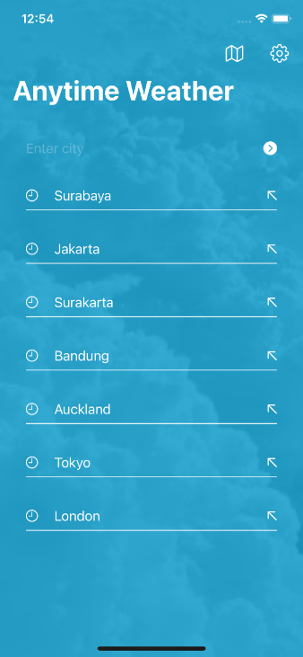
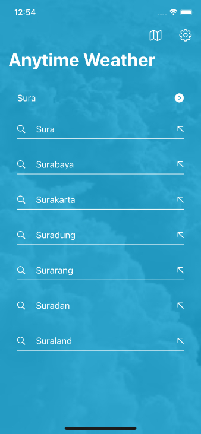
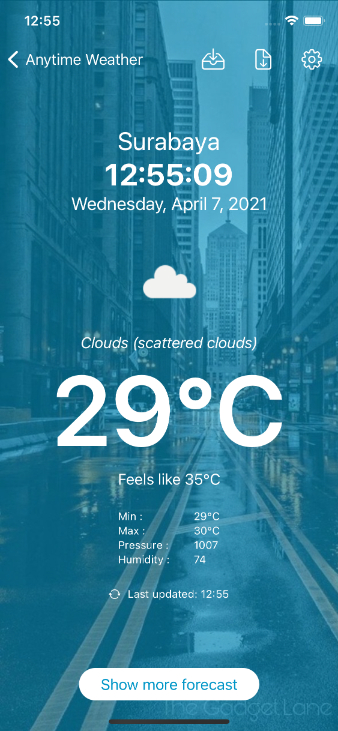
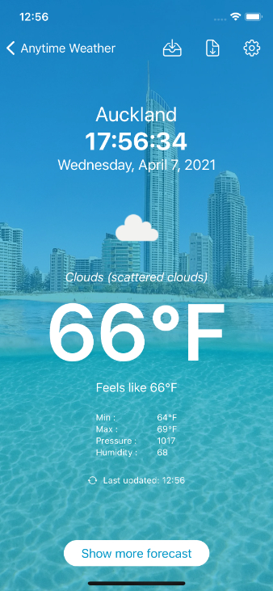
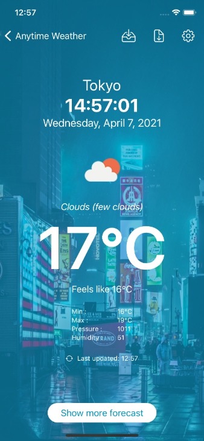
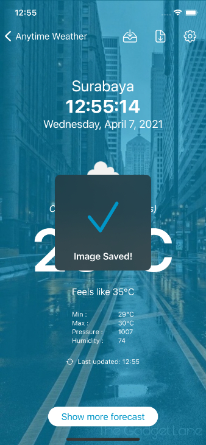

## **Anytime Weather**

Simple weather app built using:
 - **Xcode** 12.0.1 (12A7300)
 - **Swift** 5
 - **SwiftUI**
 - **OpenWeatherMap API**
 (Unit testing included)

**Screenshots:**

    
    
    

**Features:**
 - Search for location (including history and suggestions)
 - Weather information (temperature, pressure, humidity, etc)
 - Live local time 
 - Optional temperature units (Celcius or Fahrenheit)
 - Downloadable beautiful city photos and weather icons
 - Show live weather on maps (coming soon)
 - Future forecast (coming soon)
